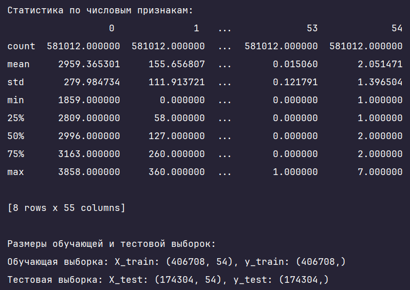
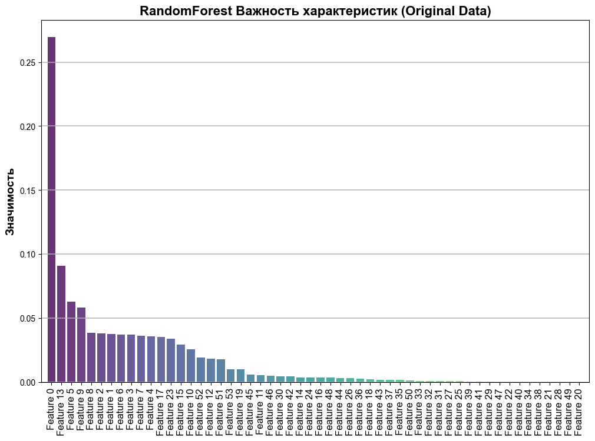
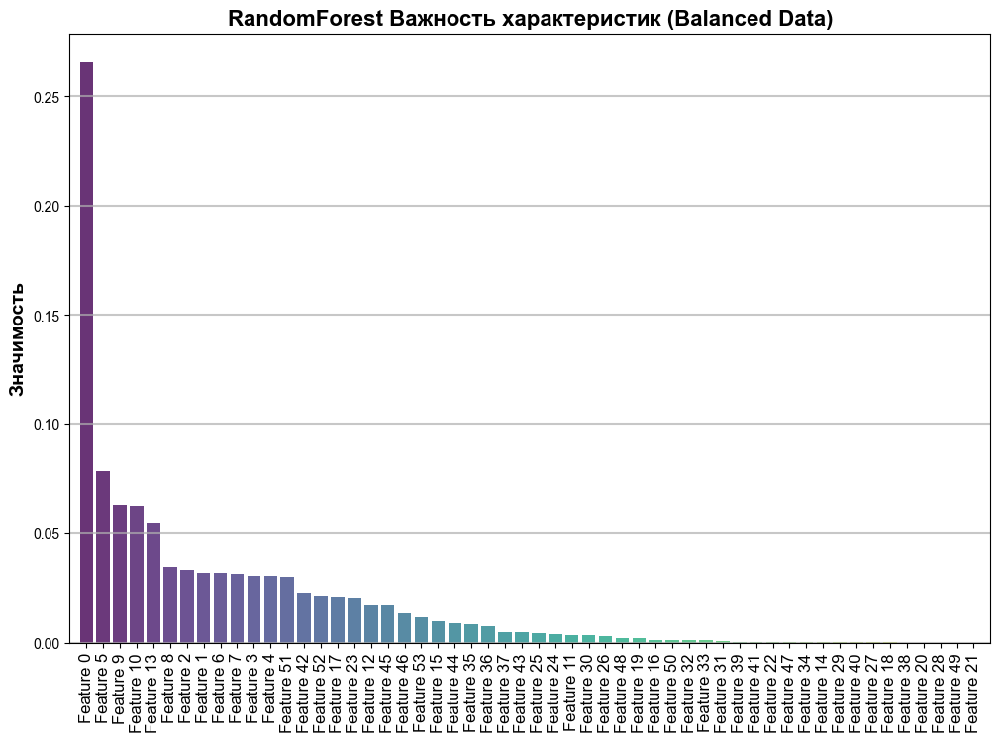
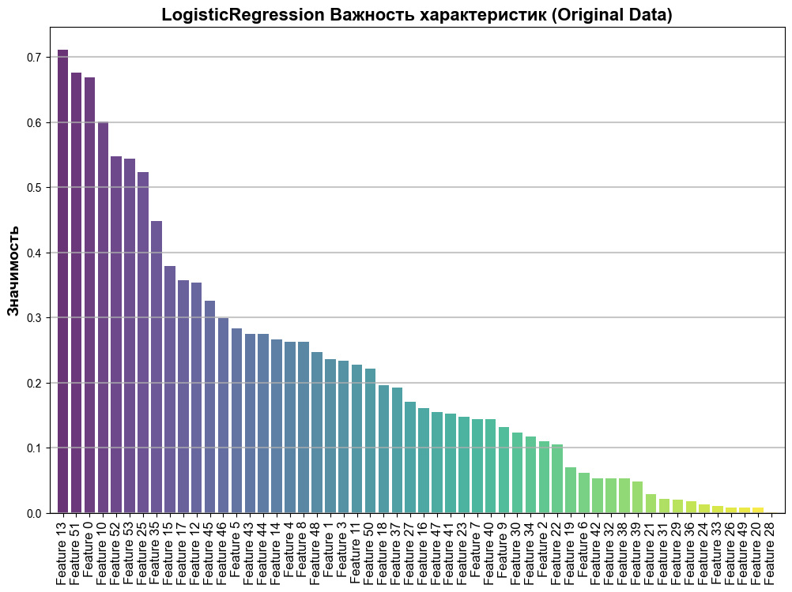
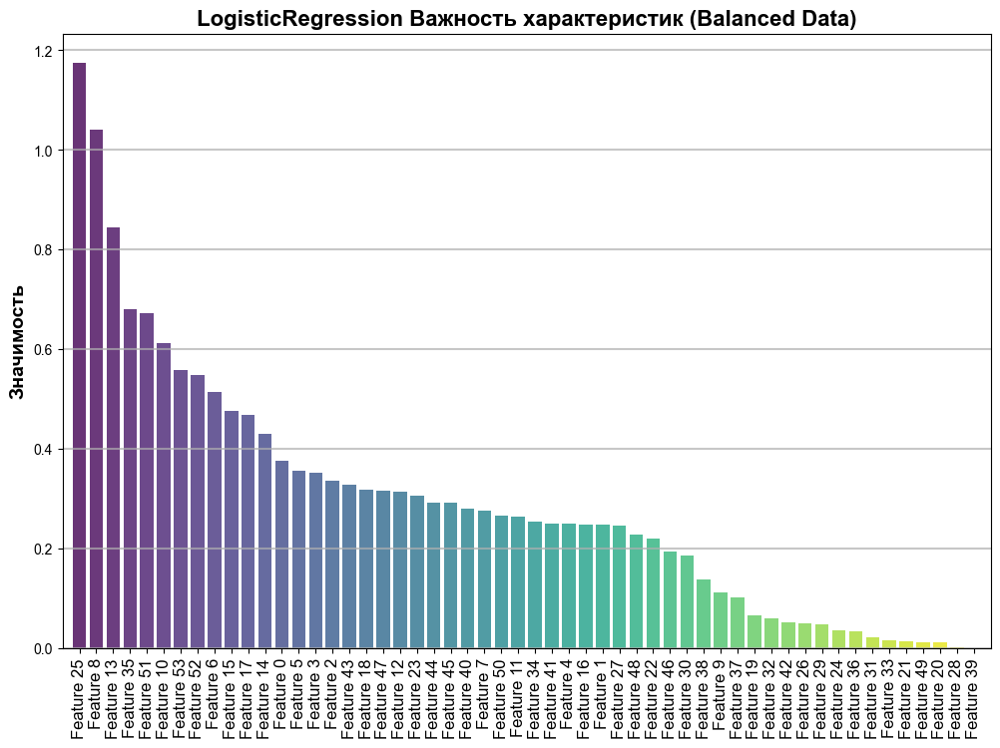
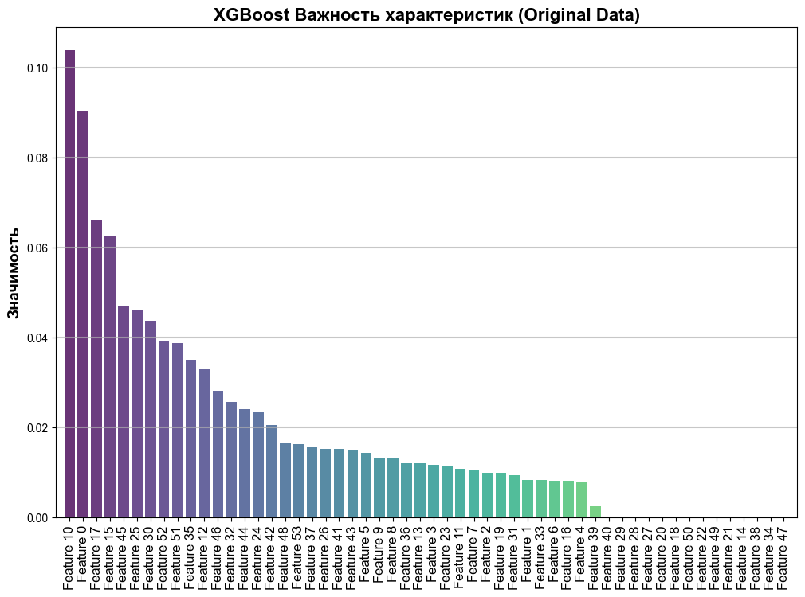
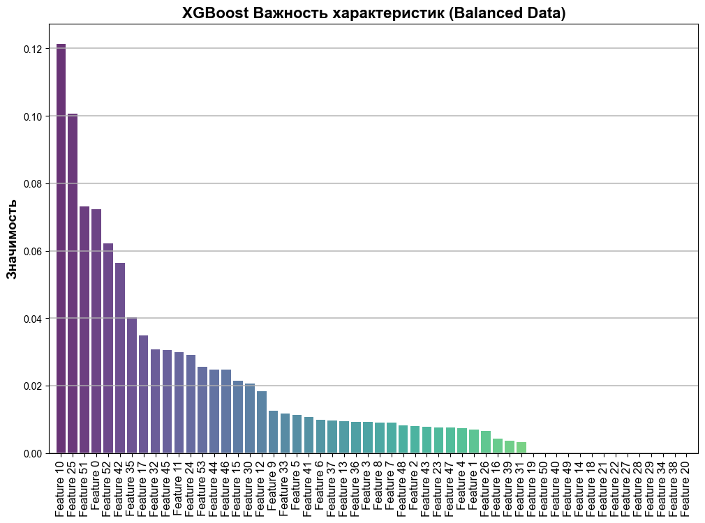
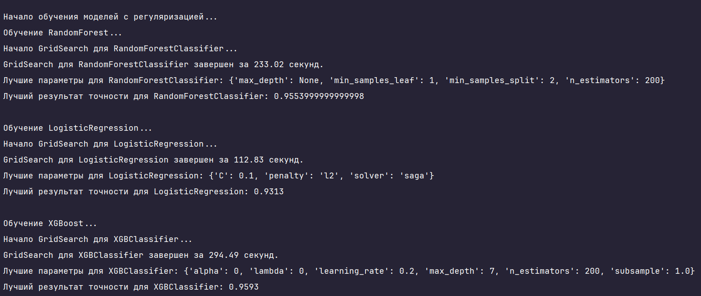
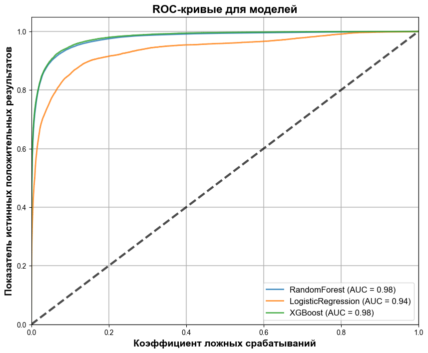
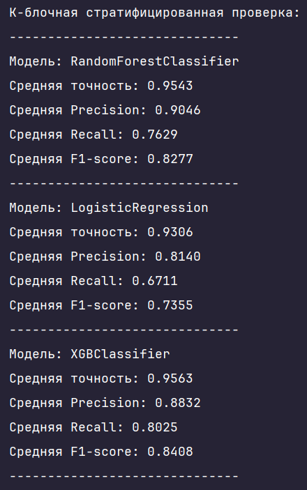

# Реализация классификаторов

## Описание
Этот проект посвящен построению и анализу классифицирующих моделей с использованием алгоритмов **RandomForest**, **LogisticRegression** и **XGBoost**.

## Функционал
- Предварительная обработка данных
- Построение моделей с использованием GridSearch для подбора гиперпараметров
- Проведение экспериментов с регуляризацией
- Выполнение ROC-анализа и визуализация результатов

## Зависимости
Для работы программы необходимы следующие библиотеки:
- `numpy` и `pandas` для работы с данными.
- `xgboost` для работы с алгоритмом XGBoost.
- `scikit-learn` для построения моделей, выполнения GridSearch и кросс-валидации.
- `matplotlib` для визуализации результатов.

## Установка и запуск проекта
1. Клонируйте репозиторий:
```
git clone https://github.com/Sogato/NNATA-lab2.git
```
2. Создайте виртуальное окружение:
```
python -m venv env
```
3. Установите зависимости проекта:
```
pip install -r requirements.txt
```
4. Запустите программу:
```
python main.py
```

# Результаты исследования
## Датасет
Обучение и тестирование проводилось с использованием датасета для прогнозирования типа лесного покрова по картографическим переменным.


### Структура и размер данных:
* Датасет содержит 581,012 записей и 55 столбцов.
* Все столбцы имеют тип данных int64. 
*  В столбцах присутствуют значения, которые могут варьироваться в довольно широком диапазоне. Например, в первом столбце значения варьируются от 1859 до 3858, а в столбце 1 от 0 до 360. 
### Целевая переменная:
* Целевая переменная (последний столбец, номер 54) изначально имеет значения от 1 до 7, что соответствует многоклассовой классификации.
* Однако в рамках данной задачи мы преобразовали её в бинарную переменную, разделив по медиане (значение 2). Таким образом, целевая переменная теперь принимает значение 0 или 1.
### Предварительная обработка:
* Признаки были масштабированы с использованием стандартизации, что привело их к единому масштабу.
* Данные разделены на обучающую и тестовую выборки в соотношении 70% на 30%.
* Обучающая выборка содержит 406,708 записей с 54 признаками (колонки без целевой переменной).
* Тестовая выборка содержит 174,304 записи с тем же количеством признаков.


## Значимость признаков
Графики значимости признаков для моделей RandomForest, XGBoost и LogisticRegression, обученных на исходных и сбалансированных выборках. 
<div style="display: flex; flex-wrap: wrap; gap: 10px;">
  <div style="flex: 1; min-width: 45%;">
    
  </div>
  <div style="flex: 1; min-width: 45%;">
    
  </div>
  <div style="flex: 1; min-width: 45%;">
    
  </div>
  <div style="flex: 1; min-width: 45%;">
    
  </div>
  <div style="flex: 1; min-width: 45%;">
    
  </div>
  <div style="flex: 1; min-width: 45%;">
    
  </div>
</div>

### RandomForest и XGBoost:
* Feature 0 оказывается наиболее важным в обоих наборах данных, что указывает на его сильное влияние на предсказания.
* Балансировка данных незначительно влияет на распределение значимости признаков, что говорит о стабильности моделей.

### LogisticRegression:
* На исходных данных значимость признаков более концентрирована на нескольких ключевых признаках, таких как Feature 13.
* После балансировки данных значимость признаков распределяется более равномерно, что показывает чувствительность логистической регрессии к дисбалансу классов.


## Обучение
В рамках второго этапа лабораторной работы были построены классифицирующие модели с использованием алгоритмов `RandomForest`, `LogisticRegression` и `XGBoost`. Основной задачей было проведение подбора гиперпараметров для каждой модели с использованием `GridSearchCV`, чтобы определить наилучшие параметры и достичь высокой точности классификации.


### RandomForestClassifier

Для RandomForest были исследованы следующие гиперпараметры:
- `n_estimators`: [100, 200, 300] - Количество деревьев в лесу.
- `max_depth`: [None, 10, 20, 30] - Максимальная глубина дерева.
- `min_samples_split`: [2, 5, 10] - Минимальное количество образцов для разбиения внутреннего узла.
- `min_samples_leaf`: [1, 2, 4] - Минимальное количество образцов в листовом узле.

**Результаты:**
- **Лучшие параметры:** `{'max_depth': None, 'min_samples_leaf': 1, 'min_samples_split': 2, 'n_estimators': 200}`
- **Лучший результат точности:** 0.9554


### LogisticRegression

Для модели логистической регрессии были исследованы следующие гиперпараметры:
- `C`: [0.01, 0.1, 1, 10, 100] - Коэффициент регуляризации (обратный коэффициент регуляризации).
- `penalty`: ['l1', 'l2'] - Тип регуляризации.
- `solver`: ['liblinear', 'saga'] - Алгоритм оптимизации.

**Результаты:**
- **Лучшие параметры:** `{'C': 0.1, 'penalty': 'l2', 'solver': 'saga'}`
- **Лучший результат точности:** 0.9313


### XGBoost

Для XGBoost были исследованы следующие гиперпараметры:
- `n_estimators`: [100, 200, 300] - Количество деревьев.
- `learning_rate`: [0.01, 0.1, 0.2] - Скорость обучения.
- `max_depth`: [3, 5, 7] - Максимальная глубина дерева.
- `subsample`: [0.8, 1.0] - Доля случайных выборок, используемых для каждого дерева.
- `lambda`: [0, 1, 10] - Коэффициент L2-регуляризации.
- `alpha`: [0, 0.1, 1] - Коэффициент L1-регуляризации.

**Результаты:**
- **Лучшие параметры:** `{'alpha': 0, 'lambda': 0, 'learning_rate': 0.2, 'max_depth': 7, 'n_estimators': 200, 'subsample': 1.0}`
- **Лучший результат точности:** 0.9593


## ROC
Для каждой модели были построены и визуализированны ROC-кривые.


* Все три модели демонстрируют хорошие результаты, так как их кривые значительно выше диагонали (случайный классификатор).
* ROC-кривые показывают, что при низком уровне ложноположительных срабатываний (False Positive Rate) модели дают высокий уровень истинных положительных срабатываний (True Positive Rate), что является признаком хорошей работы моделей.

Модели RandomForest и XGBoost показали практически одинаково высокие результаты с AUC = 0.98, что свидетельствует об их отличной способности различать классы. Модель LogisticRegression с AUC = 0.94 показала немного более низкую эффективность, что говорит о её меньшей точности в сравнении с двумя другими моделями. В целом, XGBoost и RandomForest оказываются лучшими для данной задачи.


## K-блочная стратифицированная проверка
В рамках оценки моделей были проведены эксперименты с использованием K-блочной стратифицированной проверки. Данная техника позволяет более точно оценить производительность моделей за счет многократного разделения данных на тренировочные и тестовые выборки, что минимизирует влияние случайных разбиений.


#### 1. RandomForestClassifier

- **Средняя точность:** 0.9543
- **Средняя Precision:** 0.9046
- **Средняя Recall:** 0.7629
- **Средняя F1-score:** 0.8277

Модель RandomForestClassifier показала высокие результаты, демонстрируя точность 95.43%. Несмотря на это, значение Recall (0.7629) указывает на возможность пропуска некоторых положительных классов, что отразилось на значении F1-score (0.8277). Тем не менее, Precision остается высоким, что говорит о точности предсказанных положительных классов.

#### 2. LogisticRegression

- **Средняя точность:** 0.9306
- **Средняя Precision:** 0.8140
- **Средняя Recall:** 0.6711
- **Средняя F1-score:** 0.7355

LogisticRegression, как и ожидалось, продемонстрировала более низкие результаты по сравнению с деревьями решений. Средняя точность составила 93.06%, однако Recall (0.6711) и F1-score (0.7355) показывают, что модель не так хорошо справляется с выявлением положительных классов по сравнению с RandomForest и XGBoost. Тем не менее, Precision остается на приемлемом уровне.

#### 3. XGBClassifier

- **Средняя точность:** 0.9563
- **Средняя Precision:** 0.8832
- **Средняя Recall:** 0.8025
- **Средняя F1-score:** 0.8408

XGBClassifier продемонстрировал лучшие результаты среди всех моделей. Средняя точность составила 95.63%, а также модель показала наивысшие значения Recall (0.8025) и F1-score (0.8408), что указывает на отличное соотношение точности и полноты. Модель XGBoost хорошо справляется с задачей классификации и наиболее эффективно выявляет положительные классы, сохраняя при этом высокую точность.


## Заключение
Из этого исследования можно сделать вывод, что XGBClassifier является лучшим выбором для задач классификации.  RandomForestClassifier также остается отличным выбором с несколько более высоким значением Precision.  LogisticRegression может быть полезна в менее требовательных задачах, где важна интерпретируемость модели.

---

Подготовлено в рамках учебного проекта. Все данные взяты из открытых источников и использованы исключительно в образовательных целях.

---
